<!-- @format -->

1.  개요
    Python을 이용하여 콘솔 환경에서 실행되는 퀴즈 게임을 구현하였습니다. 퀴즈를 풀고, 문제를 추가할 수 있으며 점수를 확인할 수 있습니다. 프로그램을 종료해도 JSON 파일에 문제들을 저장하여 영구적으로 사용할 수 있습니다.

2.  실행 환경

    - OS: macOS
    - Python: 3.13.2
    - 개발 도구: Visual Studio Code, Terminal

3.  수행 리스트

    - [✔] 프로그램 실행 및 메뉴 구성 구현
    - [✔] 사용자 입력 기반 패턴 판별 기능 구현
    - [✔] MAC 연산을 이용한 유사도 계산 구현
    - [✔] JSON 데이터 기반 패턴 분석 기능 구현
    - [✔] 라벨 정규화 및 판정 로직 구현
    - [✔] 입력 검증 및 예외 처리 구현
    - [✔] 성능 측정 및 시간 분석 기능 구현
    - [✔] PASS / FAIL 결과 출력 및 요약 기능 구현
    - [✔] 프로그램 안정성을 위한 종료 처리 구현

4.  디렉토리 구조

    - main.py : 프로그램 시작 파일
    - simulator.py : 전체 흐름 제어 (모드 선택 및 실행)
    - input_handler.py : 사용자 입력 처리 및 검증
    - mac.py : MAC 연산 구현
    - judge.py : 판정 및 라벨 정규화
    - json_handler.py : JSON 데이터 로드 및 검증
    - performance.py : 연산 시간 측정
    - data.json : 테스트 데이터

    기능별로 파일을 분리하여 가독성과 유지 보수하기 편하게 하였습니다.

5.  설계 구조 및 설계

    기능별 분리를 기준으로 설계하였습니다.

    - 입력 처리 → input_handler.py
    - 연산 처리 → mac.py
    - 판정 처리 → judge.py
    - 데이터 처리 → json_handler.py
    - 성능 분석 → performance.py
    - 전체 흐름 → simulator.py

    각 파일 하나의 역할만 담당하도록 설계하였고 코드의 가독성과 유지보수성을 높였으며 문제가 발생했을 때나 기능을 확장하고 싶을 때 빠르고 효율적으로 할 수 있기 때문에 저런 구조로 설계하였습니다.

6.  핵심 기술 적용

    - MAC 연산 구현

          입력 패턴과 필터의 같은 위치에 있는 값을 각각 곱한 뒤, 그 결과를 모두 더하는 방식으로 MAC 연산을 구현하였습니다.

           ```python
           for i in range(n):
                 for j in range(n):
                    total += pattern[i][j] * filter[i]  [j]
           ```

           외부 라이브러리를 사용하지 않고 이중 반복문을 이용하여 직접 구현하였으며, 각 위치의 값을 하나씩 계산해 나가는 방식으로 동작하도록 하였습니다. MAC 연산이 곱하고 계속 더하는 과정이라는 것을 직접적으로 이해할 수 있었습니다.

    - 라벨 정규화

      JSON 데이터의 다양한 표현을 통일하기 위해 표준 라벨을 사용하였습니다.

      - '+' → Cross
      - 'x' → X
      - 'cross' → Cross

      이를 통해 데이터 표현 차이로 인한 오류를 방지하고, 일관된 기준으로 판정이 가능하도록 구현하였습니다.

    - epsilon 기반 비교

      epsilon는 0에 매우 가까운 작은 값을 의미합니다. 프로그래밍에서 실수 계산을 할때는 내부적으로 오차가 발생할 수 있기 때문에 정확하게 비교하는 것은 어렵습니다.</br>
      부동소수점 연산 과정에서 발생하는 오차를 고려하여 epsilon 기반 비교를 적용하였습니다.

      ```python
      if abs(score_cross - score_x) < 1e-9:
          return "UNDECIDED"
      ```

      두 값의 차이가 epsilon(1e-9)보다 작으면 같은 값으로 판단하도록 하였고 부동소수점 연산에서 발생하는 미세한 오차로 인해 잘못된 판단이 나오는 것을 방지하였습니다.

    - JSON 데이터 처리

      - data.json 파일에서 필터와 패턴 데이터를 로드
      - 패턴 키(size_N)를 분석하여 해당 크기의 필터 선택
      - 필터와 패턴의 크기 일치 여부 검증
      - 크기 불일치 시 프로그램 종료가 아닌 FAIL 처리

      이를 통해 안정적인 데이터 처리 구조를 구현하였습니다.

    - 성능 분석

      MAC 연산의 수행 시간을 측정하기 위해 다음과 같이 구현하였습니다.

      - 동일 연산을 10회 반복 수행
      - 평균 시간을 ms 단위로 계산
      - 연산 횟수(N²)와 함께 출력

      출력 항목:

      - 크기 (N×N)
      - 평균 시간(ms)
      - 연산 횟수(N²)

7.  실행 방법

    ```python
    python3 main.py
    ```

8.  수행 결과

    1. 메뉴 화면
       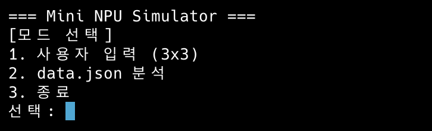

    2. 사용자 입력 화면
       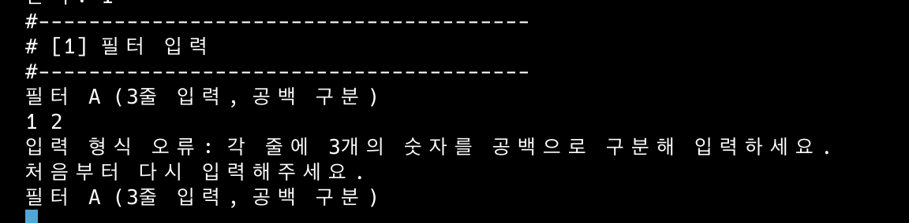

    3. 필터 잘 못 입력 했을 때
       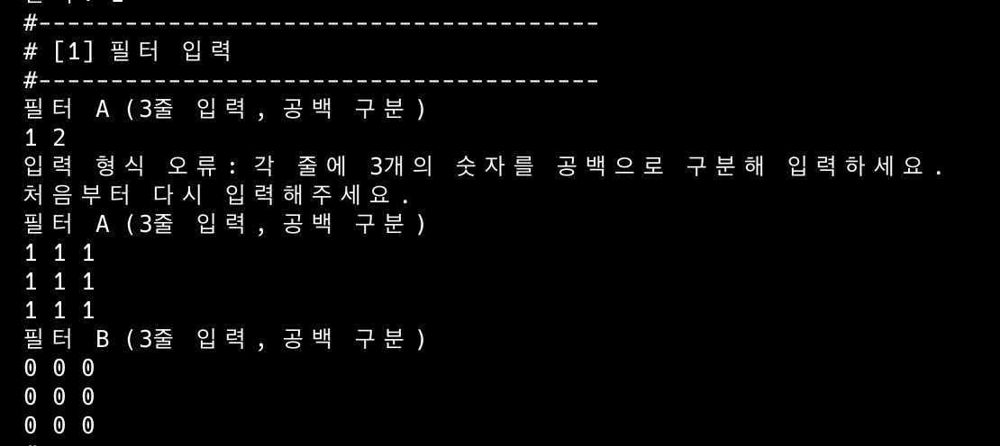

    4. 패턴 입력
       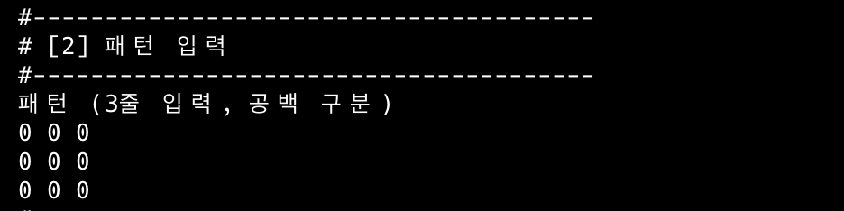\

    5. MAC 결과
       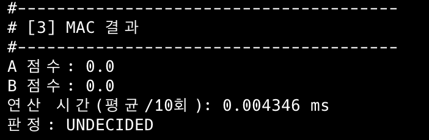\

    6. data.json 분석
       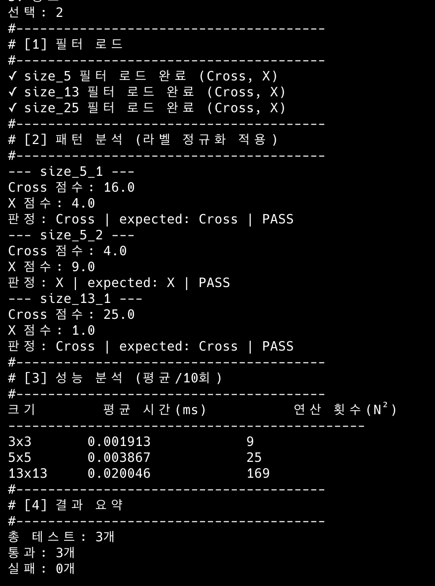\

    7. 실패 케이스들

       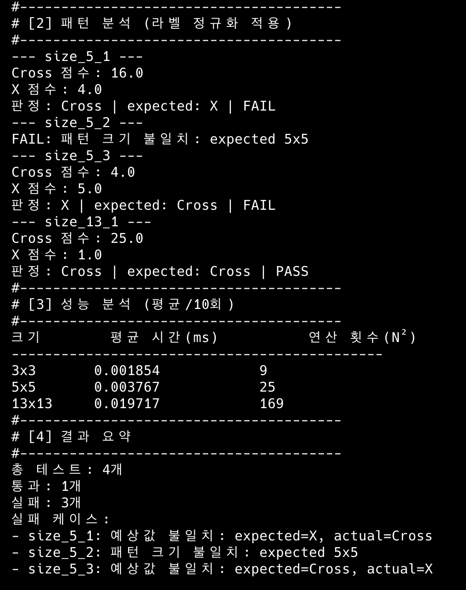\

       라벨 불일치, 크기 불일치, UNDECIDED 상황을 포함한 다양한 테스트를 수행하였습니다. 테스트 결과 전부 false를 출력하는 결과가 나왔습니다.

    8. 10개의 케이스 + 결과 요약

       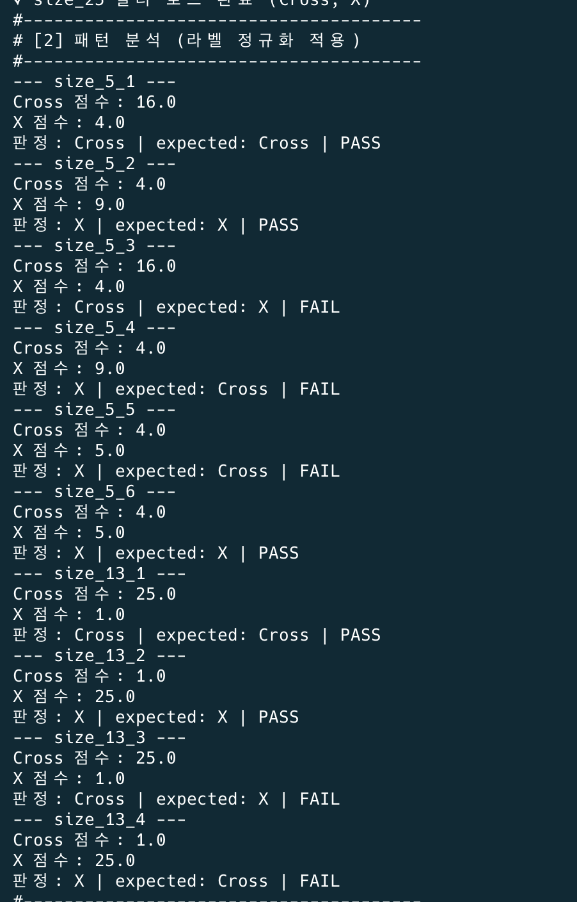\
       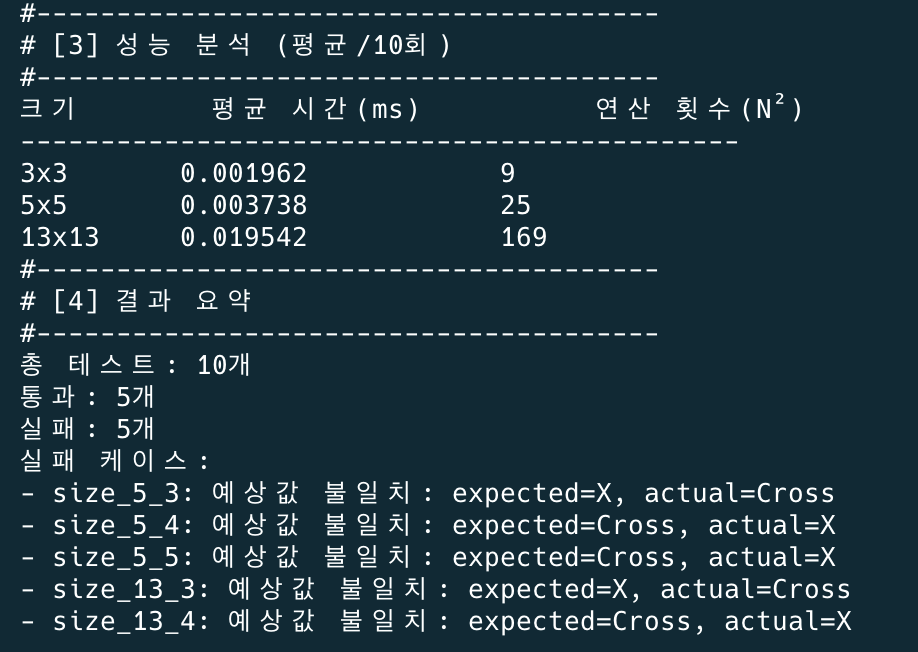\

       <실패 케이스 있는 경우>

       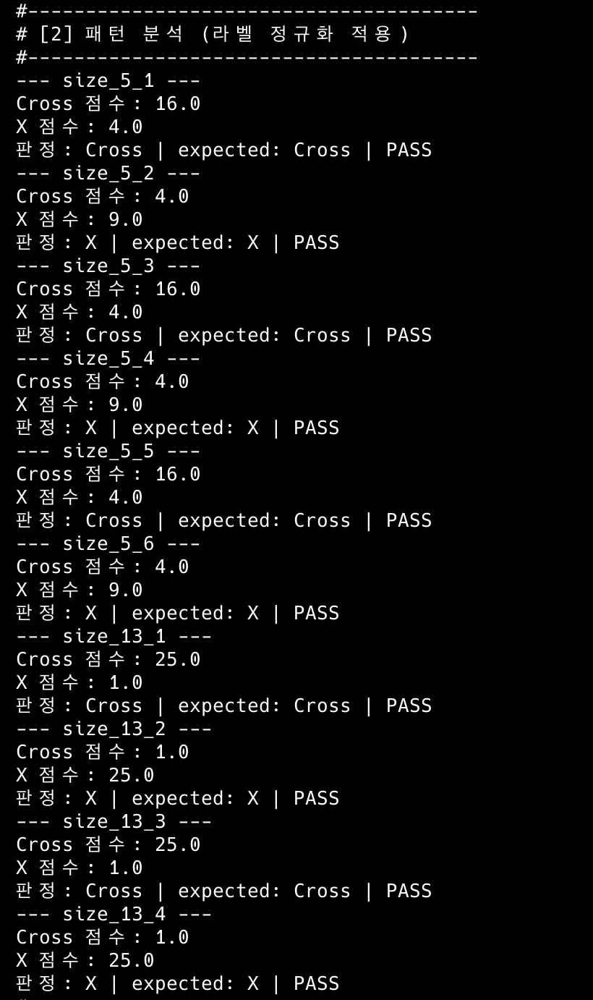\
       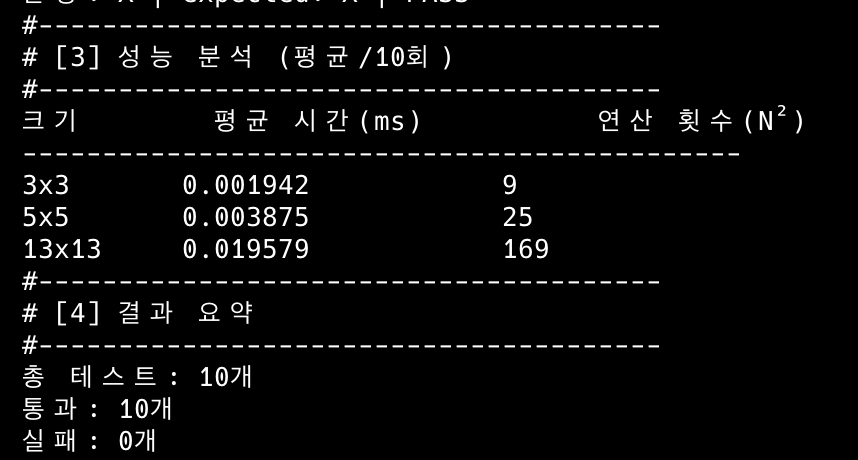\

       <전체 성공인 경우>

    9. Ctrl + C 와 Ctrl + D 누를 경우

       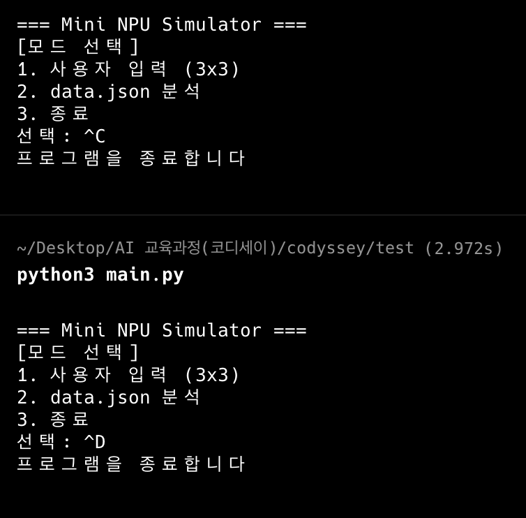\

    10. 종료 버튼

        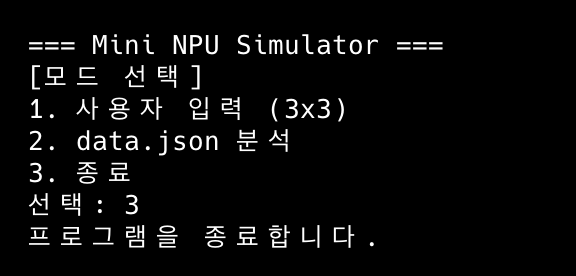\

9.  결과 리포트

    - 실패 원인
      테스트는 총 3가지 실패 상황을 중심으로 진행하였습니다.</br></br>

      첫 번째는 라벨 불일치입니다.</br>
      패턴 자체는 Cross 형태이지만 expected 값을 X로 설정한 경우입니다.
      이 경우 MAC 연산 결과는 Cross가 더 높게 나오지만, expected 값과 다르기 때문에 FAIL이 발생합니다.
      이를 통해 판정 로직이 올바르게 동작하는지 확인할 수 있었습니다.</br></br>

      두 번째는 크기 불일치입니다.</br>
      패턴의 크기와 필터의 크기가 서로 다른 경우입니다.
      MAC 연산은 같은 크기의 배열에서만 가능하기 때문에, 크기가 다르면 연산 자체가 불가능합니다.
      이 경우 프로그램이 종료되지 않도록 FAIL로 처리하도록 구현하였습니다.</br></br>

      세 번째는 UNDECIDED 상황입니다.</br>
      Cross와 X의 점수가 거의 비슷하게 나오도록 패턴을 구성한 경우입니다.
      두 값의 차이가 매우 작아 epsilon 기준에 의해 UNDECIDED로 판정되며, expected 값과 다를 경우 FAIL이 발생합니다.
      이를 통해 부동소수점 오차와 epsilon 비교의 필요성을 확인할 수 있었습니다.</br></br>

      이 세 가지 테스트를 통해 다양한 상황에서도 프로그램이 안정적으로 동작하는 것을 확인할 수 있었습니다.

    - 시간 복잡도 분석

      MAC 연산은 반복문을 이용하여 모든 값을 하나씩 계산하는 방식으로 구현되어 있습니다.

      ```python
      for i in range(n):
          for j in range(n):
              total += pattern[i][j] * filter[i][j]
      ```

      위 코드를 보면 반복문이 두 번 사용되고 있습니다.
      첫 번째 반복문은 행(row)을 기준으로 돌고, 두 번째 반복문은 열(column)을 기준으로 돕니다.

      즉, 한 번의 계산에서 모든 칸을 하나씩 확인하게 되므로 총 연산 횟수는 "가로 개수 × 세로 개수"가 됩니다.
      이러한 구조를 시간 복잡도로 표현하면 O(N²)이라고 합니다.
      이는 입력 크기가 커질수록 계산량이 빠르게 증가한다는 의미입니다.

      실제 실행 결과에서도 패턴 크기가 커질수록 연산 시간이 증가하는 것을 확인할 수 있었습니다.
